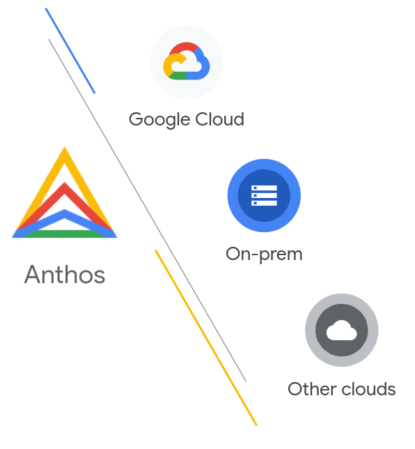
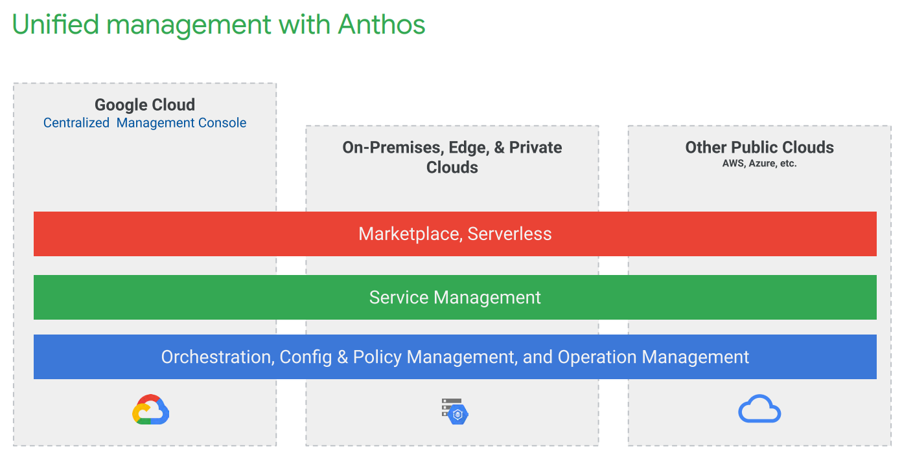

======================================
Hands on with Anthos
======================================

I am super excited to start this post. We've seen some great progress in terms of features available in Anthos.
I'm lucky enough to be working with both the product teams and Google's customers gaining new insights everyday on how to successfully take 
these platforms from pilots to production. I'm delighted to share details of the platform with the wider community. 

For those who are not familiar, Anthos is a software platform available from Google. This platform enables Google's customers to build secure, scalable 
solutions that can be placed on-prem, in GCP or other clouds. Giving customers the ability to place services where it makes sense whilst gaining a consistent way 
to design, deploy, secure, operate and scale no matter the location.
It's unique as it brings together a number of projects from the OSS community (which Google actively contributes heavily)
into a supported, enterprise ready platform to architect, deploy and operate distributed applications in GCP, on-prem and other clouds. This also provides 
our customers with choice. As the fundamentals are built on OSS this provides a way to build an enterprise platform whilst vendor reducing lock in.

The key items that are of focus are:

1. Container Management

*Fundamentally this is the base layer of infrastructure abstraction and container scheduling/orchestration. Through Google's lens this means GKE.
Did you know you can run GKE on-prem and manage centrally from GCP? Kinda neat right!*

2. Service Management
*Service Mesh.. This space has a lot of attention right now. Both positive and negative. 
Fundamentally the Service Mesh projects exist to  help connect, secure and manage microservices.
This helps simplify the developer efforts by handling the insertion and lifecycle of tls, provide deep visibility including SLA/SLO's of the network
and provide the application owners a simple way to deliver canary deployments.* 

3. App Development and Deployment
*This is an interesting space. Through the Google lens this means bringing Knative (think serverless containers. This blog actually runs on Cloud which is the productised version o Knative), 
a marketplace and CD tools into the platform*

4. Operations Management
*This is a point that i'm quite passionate about. It's all good and well to build an amazing system but if we cannot
 operate it or gain insights to it we're going to have a tough time later on. Within Anthos we ensure that all logs are captured as well as 
 dashboards showing clearly how services are interconnected etc* 

5. Policy Management
*Policy.... This is important for the enterprise. Here we're talking about brining a declarative way to describe, implement
and enforce guardrails into your kubernetes platform. Quick example. Ensuring that all services communicate of mTLS.*
 

Now let's get started.

Objective
---------
In this tutorial, you're introduced to some of the key features of Anthos through the following tasks:

- Complete prerequisites to prepare for your Anthos Sample Deployment.

- Deploy your Anthos environment with clusters, application, and Anthos components: Anthos Service Mesh and Anthos Config Management.

- Use the Google Cloud Console to explore the Anthos GKE resources used by your application.

- Review application services by using Anthos Service Mesh.

- Use an SLO to monitor for unexpected behavior.

- Enforce mutual TLS (mTLS) in your service mesh by using Anthos Config Management.

Steps
---------

01. Sign up for $300 UDS credit at https://cloud.google.com

02. Get started with the codelab 

https://codelabs.developers.google.com/codelabs/anthos-sample-deployment/#0

03. Deploy the Anthos Sample Deployment

https://console.cloud.google.com/marketplace/details/click-to-deploy-images/anthos-sample-deployment

04. Get cracking on the codelab!

Follow the guide from Step 2. No need for me to reinvent the wheel here....

05. Next Steps

Download the "Under the Hood" whitepaper for more information. It's a great start to explain some of the "how's and why's" of the solution.
Inside, you’ll find information on the following:

- Enterprise-grade container orchestration and management

- Defining configuration and enforcing policies across environments

- Managing and securing traffic between services

- Monitoring, troubleshooting, and improving application performance

- Simplifying the developer experience with serverless anywhere

- Modern CI/CD with automated development tools and expert guidance

- Deploying enterprise-grade, out-of-the-box integrated solutions from an ecosystem of partners

Download the Anthos_ whitepaper

.. _Anthos: https://inthecloud.withgoogle.com/content-anthos/dl-cd.html

BD

