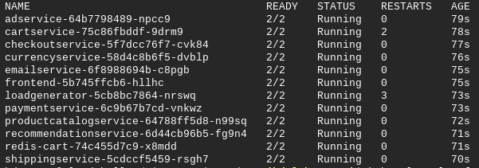
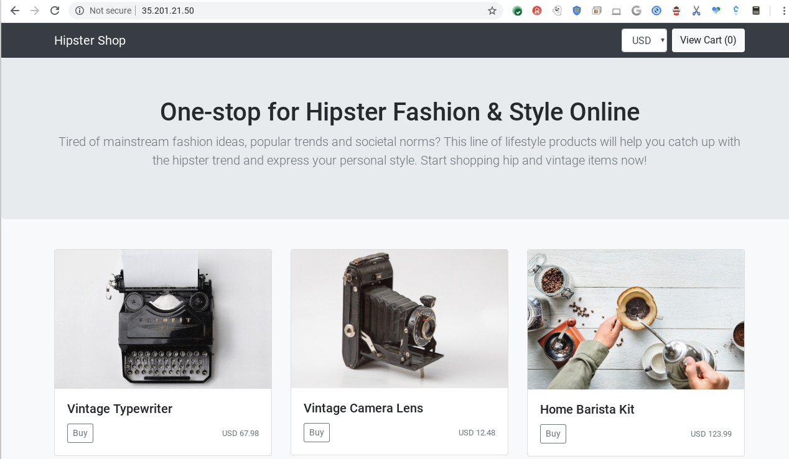
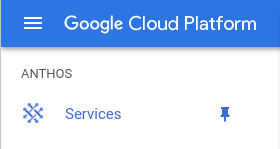
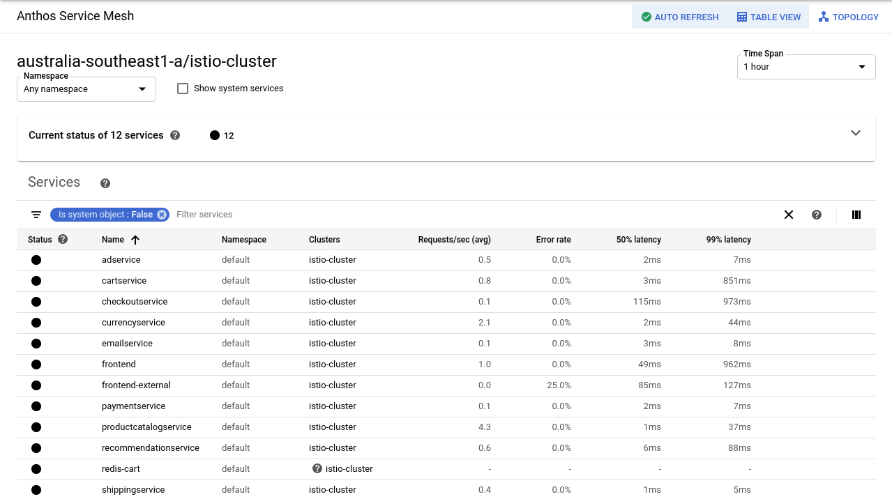
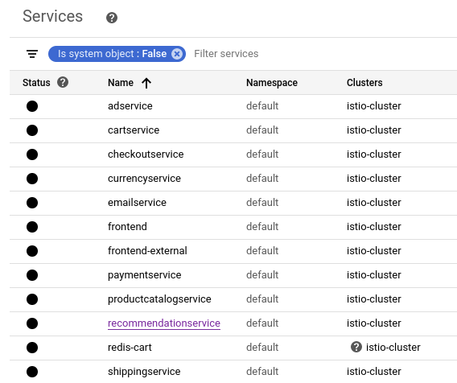
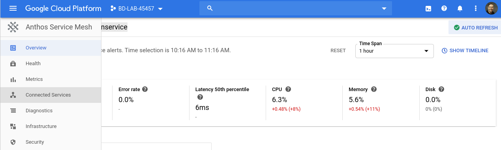

======================================
Installing Istio Service Mesh on GKE.
======================================

.. image:: _images/istio.png
    :align: left
    :width: 400

Over the past few years we've been hearing and talking about a Service Mesh. To me this technology 
certainly can solve many problems in both digitel natives and traditional enterprise alike. I'm very much
enjoying watching the SM space mature and really form a value statement that many architects I speak to are
looking for. If we say that kubernetes has won. Then we will continue to see larger/more complex kubernetes 
deployments which will further drive the need for a Service Mesh.
At a high level there are a few capabilities a Service Mesh will provide. 
Offload certificate mangement (mTLS) from the developers.
Provide the SRE/Ops teams with insight into service performance/latency and to further abstract services from the network.

Objective
---------
The intent of this post is to share the installation process to get the OSS version of Istio Service Mesh 
on our GKE cluster. This is more of an enablement and prep before I go ahead and test out Anthos SM or ASM which it will be known as. 
ASM will provide the capability to build your mesh across many clusters and clouds. ASM is just one componant of Anthos that has been built
to help our customers build and manage highly scalable systems across multiple cloud and also on-premise DC's.

More information on Anthos_

.. _Anthos: https://cloud.google.com/anthos

Steps
---------

**01. Activate the Cloud Shell**

From the GCP console ensure that you have your project selected. Then you can select the below icon to 
activate Cloud Shell

.. image:: _images/cloud-shell.png
    :align: left

Then you will see a terminal window open up at the bottom of your console tab.

**02. Here is a guide to getting your first GKE_ cluster up and running**

.. _GKE: https://cloud.google.com/kubernetes-engine/docs/how-to/creating-a-cluster
or, you can enter the below into your cloud-shell session.

.. note:: 
    I've highlighted the ``csm`` label. This is important while Anthos Service Mesh or ASM for short is in Beta as it allows access to the UI.

.. code-block:: bash
    :emphasize-lines: 17
    :linenos:

    GCP_PROJECT=$(gcloud config list --format "value(core.project)")
    export IDNS=${GCP_PROJECT}.svc.id.goog

    gcloud compute networks subnets update default \
        --region australia-southeast1 \
        --add-secondary-ranges pods=10.60.0.0/14 

    gcloud beta container clusters create istio-cluster --zone \
        australia-southeast1-a \
        --enable-ip-alias \
        --machine-type n1-standard-4 \
        --identity-namespace=${IDNS} \
        --enable-stackdriver-kubernetes \
        --subnetwork=default \
        --cluster-secondary-range-name=pods \
        --services-ipv4-cidr=10.120.0.0/20 \
        --labels csm=
        --max-nodes=3

**03. Once you have this up and running we need to enable access to a few API's in GCP**

.. code-block:: bash
    :linenos:

    gcloud services enable \
        cloudresourcemanager.googleapis.com \
        container.googleapis.com \
        containeranalysis.googleapis.com \
        binaryauthorization.googleapis.com \
        gkeconnect.googleapis.com \
        gkehub.googleapis.com \
        serviceusage.googleapis.com \
        sourcerepo.googleapis.com \
        iamcredentials.googleapis.com \
        contextgraph.googleapis.com \
        stackdriver.googleapis.com

**04. Download and prepare to deploy Istio to the new cluster**

.. code-block:: bash
    :linenos:

    curl -L https://istio.io/downloadIstio | sh -

.. code-block:: bash

    cd istio-1.4.3

.. code-block:: bash

    export PATH=$PWD/bin:$PATH

These instructions are taken from Istio's site_

.. _site: https://istio.io/docs/setup/getting-started/

Note: ``Current latest version is 1.4.3.`` 

**05. Create an alias using kubectx to make it easier to refer to the istio cluster**

.. code-block:: bash
    :linenos:

    GCP_PROJECT=$(gcloud config list --format "value(core.project)")
    kubectx istio-cluster=gke_${GCP_PROJECT}_australia-southeast1_istio-cluster

**06. The cluster we just provisioned uses Workload Identity for authenticating with GCP Services**

This provides an improved security posture for when applications running into GKE need to connect to GCP Services. 
The application we will be deploying later will be shipping traces to Stackdriver. 
Run the following commands to configure Workload Identity for the default namespace that we’ll be 
running our application in.  

.. code-block:: bash
    :linenos:

    gcloud iam service-accounts create microservices-demo
    gcloud projects add-iam-policy-binding ${GCP_PROJECT} \
    --member=serviceAccount:microservices-demo@${GCP_PROJECT}.iam.gserviceaccount.com \
    --role=roles/cloudtrace.agent

    gcloud projects add-iam-policy-binding ${GCP_PROJECT} \
    --member=serviceAccount:microservices-demo@${GCP_PROJECT}.iam.gserviceaccount.com \
    --role=roles/cloudprofiler.agent

    gcloud iam service-accounts add-iam-policy-binding \
    --role roles/iam.workloadIdentityUser \
    --member "serviceAccount:${GCP_PROJECT}.svc.id.goog[default/default]" \
    microservices-demo@${GCP_PROJECT}.iam.gserviceaccount.com

    kubectl annotate serviceaccount \
    --namespace default \
    default \
    iam.gke.io/gcp-service-account=microservices-demo@${GCP_PROJECT}.iam.gserviceaccount.com

**07. Deploy Istio to the new cluster and define your profile**

Firstly, we'll be deploying the ``Demo`` profile as it meets my needs. At a high level a pofile 
is a pre-built definition of what features get enabled.
More information on Istio profiles is available on the Istio_ site.

.. _Istio: https://istio.io/docs/setup/additional-setup/config-profiles/

.. code-block:: bash
    :linenos:

    istioctl manifest apply --set profile=demo \
    --set values.global.mtls.auto=true  \
    --set values.global.mtls.enabled=false 

This tasks shows a simplified workflow for mutual TLS adoption as per Istio documentation_

.. _documentation: https://istio.io/docs/tasks/security/authentication/auto-mtls/

With Istio auto mutual TLS feature, you can adopt mutual TLS by only configuring authentication policy 
without worrying about destination rule.

**08. Enable Istio injection to your namespace**

.. code-block:: bash
    :linenos:

    kubectl label namespace default istio-injection=enabled

**09. Deploy Hipster Shop Demo application**

For this example we will be making use of self-signed certs as part of the deployment. Also, we will be following the 
guide from Google's git_ page.

.. _git: https://github.com/GoogleCloudPlatform/microservices-demo

As per below we will clone the hipster app repo, enable the Google Container Registry and auth GCR with docker.

.. code-block:: bash
    :linenos:

    git clone https://github.com/GoogleCloudPlatform/microservices-demo.git
    cd microservices-demo
    gcloud services enable containerregistry.googleapis.com
    gcloud auth configure-docker -q

We'll be using Skaffold to help deploy hipster shop to GKE. Skaffold is a command line tool that facilitates continuous development for Kubernetes applications
More information available at here_

.. _here: https://github.com/GoogleContainerTools/skaffold

.. code-block:: bash
    :linenos:

    skaffold run -p gcb --default-repo=gcr.io/[PROJECT_ID]

The above code will build the images, tag these images, push to GCR and deploy the hipster shop images to GKE.

Next up we need to connect to our kubernetes cluster via cloud shell.
We should see all of our pods running with the below command. Take note we should see 2/2 underneath "ready". This indicates that Envoy has been deployed.

.. code-block:: bash
    :linenos:

    gcloud container clusters get-credentials istio-cluster --zone australia-southeast1-a --project [PROJECT_ID]
    kubectl get pods

Let's take a moment to consider what we have deployed so far. We have a working hipster shop that is accessable via 
the front end load balancer. We can obtain the front end LB IP with the below command.

.. code-block:: bash
    :linenos:

    kubectl get svc

Take a look got the ``LoadBalancer`` IP next to the ``frontend-external`` service name.
You will be able to browse to this IP and access the shopfront. (assuming you're working with GKE and not a local environment with NodePort etc)
This is not however making use of Isio's ingress capabilities.

**10. Enable Istio for Ingress on our new Hipster Shop application**

.. code-block:: bash
    :linenos:

    kubectl apply -f istio-manifests

If you take a look inside the istio-manifests directory you will find 3 .yaml files.
The ``frontend-gateway.yaml`` file configures the Istio ingress gateway. The ``frontend.yaml`` defines a virtual service 
for our load generator. The ``whitelist-egress-googleapis.yaml`` file configures what external hosts can be accessed from within the mesh.

To obtain the external Service Mesh ingress IP. Run the following and browse to the IP in your browser.

.. code-block:: bash   
    :linenos:

    kubectl -n istio-system get service istio-ingressgateway -o jsonpath='{.status.loadBalancer.ingress[0].ip}'

At this point we need to make a decision. Learn more about Promethius and Grafana or integrate out mesh with Stackdriver and Anthos Service Mesh.
For my learnings I will focuss on the later.

Therefore we need to enable Istio Telemetry. This will help us understand two key things regarding application. Security and health. Pretty important right!

**11. Enable Mixer to share Telemety data to Stackdriver**

To integrate the differerent logging and montioring servies we need to connect Istio's Mixer with Stackdriver and Antho Service Mesh. Mixer supports a variety of adapters to integrate with different systems.

First up, Stackdriver

.. code-block:: bash
    :linenos:

    CLUSTER_ZONE=australia-southeast1-a
    CLUSTER_NAME=istio-cluster
    ACCOUNT=$(gcloud config get-value account)
    GCP_PROJECT=$(gcloud config list --format "value(core.project)")
    MESH_ID="${GCP_PROJECT}_${CLUSTER_ZONE}_${CLUSTER_NAME}"
    gsutil cat gs://csm-artifacts/stackdriver/stackdriver.istio.csm_beta.yaml \
    | sed 's@<mesh_uid>@'${MESH_ID}@g | kubectl apply -f -

We also need to enable Mixer's pod service account to access Stackdriver. So let's create a service account.

.. code-block:: bash
    :linenos:

    gcloud iam service-accounts create istio-mixer \
    --display-name istio-mixer --project ${GCP_PROJECT}

Grant the service account permissions to sent telemetry to Stackdriver

.. code-block:: bash
    :linenos:

    GCP_PROJECT=$(gcloud config list --format "value(core.project)")
    gcloud projects add-iam-policy-binding ${GCP_PROJECT} \
    --member=serviceAccount:istio-mixer@${GCP_PROJECT}.iam.gserviceaccount.com \
    --role=roles/contextgraph.asserter

    gcloud projects add-iam-policy-binding ${GCP_PROJECT} \
    --member=serviceAccount:istio-mixer@${GCP_PROJECT}.iam.gserviceaccount.com \
        --role=roles/logging.logWriter

    gcloud projects add-iam-policy-binding ${GCP_PROJECT} \
    --member=serviceAccount:istio-mixer@${GCP_PROJECT}.iam.gserviceaccount.com \
        --role=roles/monitoring.metricWriter

Now we need to bind the Kube Service Account that Mixer uses to the ``istio-mixer`` service account we just created.

.. code-block:: bash
    :linenos:

    gcloud iam service-accounts add-iam-policy-binding \
        --role roles/iam.workloadIdentityUser \
        --member "serviceAccount:${GCP_PROJECT}.svc.id.goog[istio-system/istio-mixer-service-account]" \
        istio-mixer@${GCP_PROJECT}.iam.gserviceaccount.com

Ensure that Mixer's service account is using the GSA by adding a workload identity annotation.

.. code-block:: bash
    :linenos:

    kubectl annotate serviceaccount \
   --namespace istio-system istio-mixer-service-account \
      iam.gke.io/gcp-service-account=istio-mixer@${GCP_PROJECT}.iam.gserviceaccount.com

Restart Mixer

.. code-block:: bash
    :linenos:

    kubectl scale deployment istio-telemetry --replicas=0 -n istio-system
    sleep 10
    kubectl scale deployment istio-telemetry --replicas=1 -n istio-system

**12. Explore some ASM UI features via the GCP Console UI**

From the console select the *Navigate* button and scroll down. We should see Anthos Service Mesh available.

Once we brows to the ASM menu we should see our services as per below. 
Note we can see the requests/sec, error rate and so on. That is due to the earlier configuration we did with Stackdriver.

Next up, let's check to see if we're enforcing mTLS between services. 
From the ASM landing page select *recommendationservice*.

From here you can define SLO's and explore the health, metrics and so on down the left-hand *navigate* menu. Select *Connected Services*.

Here we can see a green padlock for the *Inbound* Frontend services accessing the *recommendationservice*. 
This means that mTLS has been configured without our development teams needing to thing about this. 
I recall some time back having conversations on how we can encrypt east-west comms on legacy apps without needing to open up the application code. 
During this time we were exploring how the network can solve such challenges. But when you think about the overhead and reliance on physical ASIC's to implement 
such capabilities scale became a very real concern.

There is a lot more we can do with the security side of things. I'd suggest exploring the Istio documentation_ . 
It's a great resource. We've configured Istio auto mutual TLS feature, 
you can adopt mutual TLS by only configuring authentication policy without worrying about destination rule.

.. _documentation: https://istio.io/docs/tasks/security/

Hopefully that helps you get started with deploying OSS Istio to GKE.
Worst case, this is just some documentation that I can refer back to when needed :)

Next, I'll be explooring *Canary* deployments with Istio.

